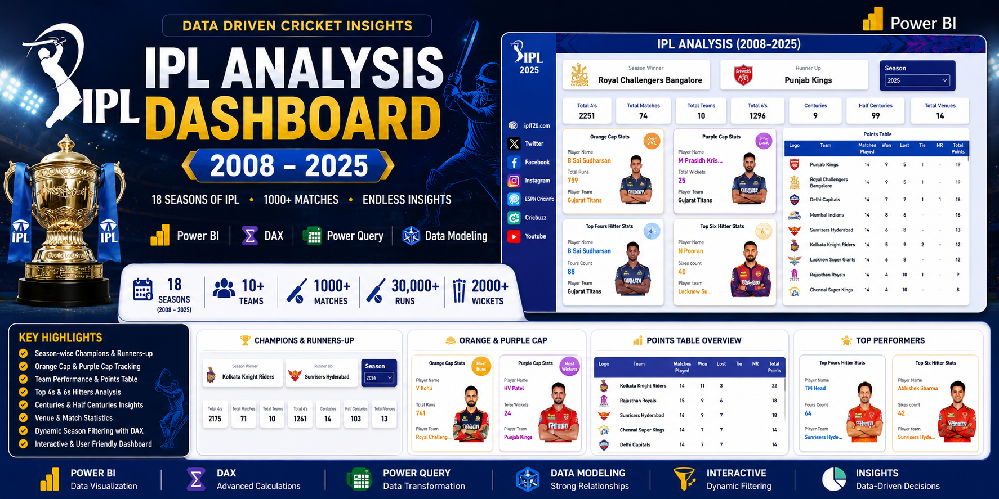
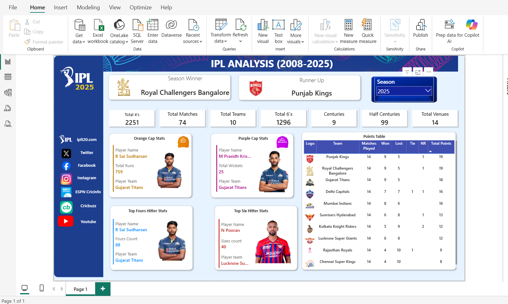
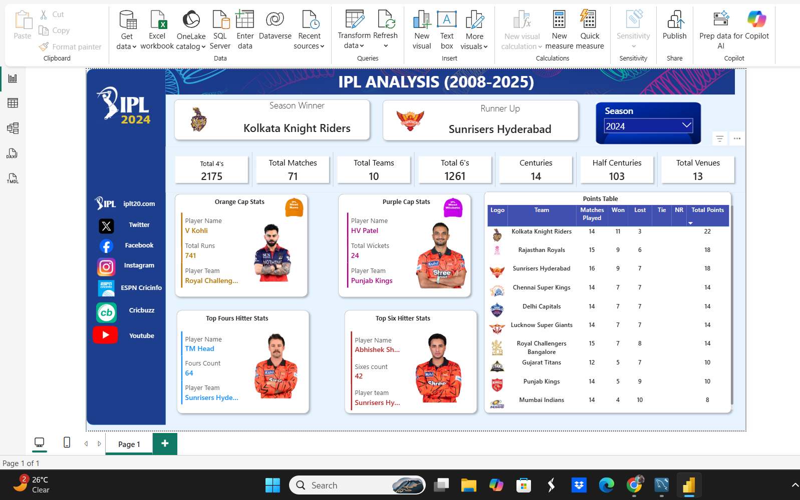
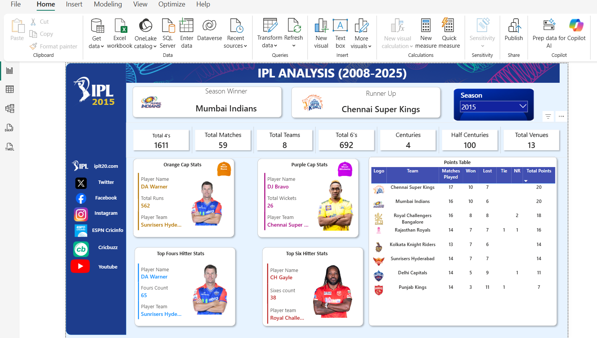
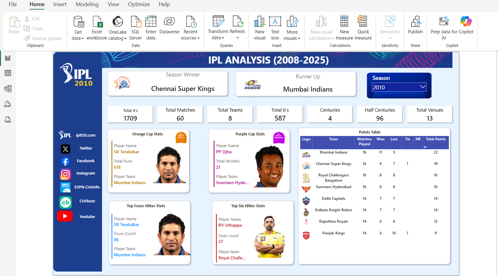

# 🏏 IPL Analysis Dashboard (2008-2025)

## Project Overview

This project is an interactive Power BI dashboard that analyzes IPL seasons from 2008 to 2025. The dashboard enables season-wise exploration of team performance, player statistics, championship history, and key tournament trends through interactive visualizations and DAX-driven insights.

The dashboard provides insights into:

- Season Winners & Runners-Up
- Orange Cap Winners
- Purple Cap Winners
- Team Performance
- Points Tables
- Boundary Statistics
- Venue Analysis

---

## Key Features

* Dynamic season-wise filtering from 2008–2025
* Automatic Champions and Runners-Up identification
* Orange Cap and Purple Cap tracking
* Team-wise points table analysis
* Boundary statistics (4s and 6s)
* Venue and match insights
* Interactive dashboard navigation

---

## Tools Used

- Power BI
- DAX
- Power Query
- Data Modeling

---

## Skills Demonstrated

* Advanced DAX (CALCULATE, FILTER, SUMMARIZE, VAR)
* Data Modeling and Relationship Management
* Power Query Data Transformation
* KPI and Metric Development
* Interactive Dashboard Design
* Sports Analytics and Data Storytelling
* Performance Optimization

---

## DAX Concepts Used

- CALCULATE
- FILTER
- SUMMARIZE
- VAR
- RANKX
- TOPN
- ALL
- SELECTEDVALUE
- CALCULATETABLE
- EARLIER

---

## Dashboard Preview

### IPL 2025

### IPL 2024

### IPL 2015

### IPL 2010

---

## Key Metrics

- 18 IPL Seasons Analyzed
- 1000+ Matches
- 10 Teams
- 250+ Players
- Dynamic Season Filtering

---

## Dataset

The dataset used in this project has not been included in this repository due to file size limitations. The Power BI dashboard (.pbix) and dashboard screenshots are provided for project demonstration purposes.

---

## Project File

The complete Power BI dashboard file (.pbix) has been included in this repository for reference and learning purposes.

---

## Learning Note

This project was developed as part of my Power BI learning journey to strengthen my understanding of dashboard development, data modeling, Power Query, and advanced DAX concepts.

The initial dashboard concept was inspired by publicly available learning resources. I recreated the solution independently, implemented the calculations, explored the underlying business logic, and customized the project to deepen my analytical and visualization skills.

---

## Author

Dharmik Shah
